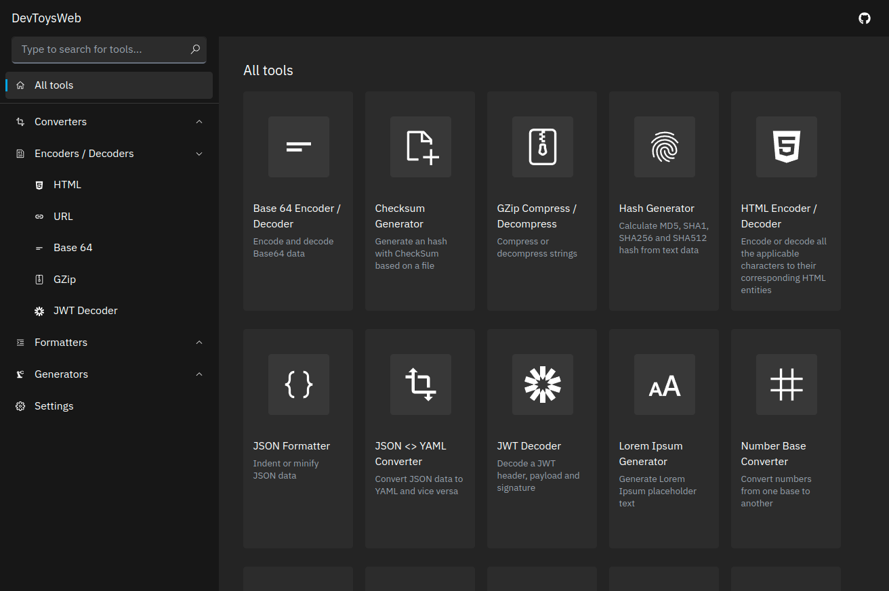

# DevToysWeb



This is yet another version of [DevToys](https://github.com/veler/DevToys). It is built with [Next.js](https://nextjs.org/) and you can access it from the following URL:

https://devtoys.vercel.app

It is being developed with the following goals in mind:

* It should work on any OS by running on the web.
  * At the same time, it should work in a completely offline environment as a PWA (although this has not been implemented yet).
* It should have almost the same functionality and appearance as the original.
  * Support for dark mode and i18n is also important.

Therefore, I'm currently planning to follow the original project in the future development.

## Development Status

* Converters
  * ✅ JSON <> YAML
  * ✅ Number Base
* Encoders / Decoders
  * ✅ HTML
  * ✅ URL
  * ✅ Base64
  * ✅ GZip
  * ✅ JWT Decoder
* Formatters
  * ✅ JSON
  * ✅ SQL
  * ✅ XML
* Generators
  * ✅ Hash (MD5, SHA1, SHA256, SHA512)
  * ✅ UUID 1 and 4
  * ✅ Lorem Ipsum
  * 🚧 Checksum
* Text
  * 🚧 Inspector & Case Converter
  * 🚧 Regex Tester
  * 🚧 Text Comparer
  * 🚧 Markdown Preview
* Graphic
  * 🚧 Color Blindness Simulator
  * 🚧 PNG / JPEG Compressor
  * 🚧 Image Converter

## Translation

1. Create a directory for the new locale in `data/locales` and copy all files in `data/locales/en` to it.
2. Update the value of the `localePath` variable in `nav.ts` and translate the strings in `messages.ts` and `nav.ts`.
3. Add a case for the new locale in `hooks/useLocale.ts`.
4. Add a value for the new locale to `languageOptions` variable in `pages/settings`.tsx

## Development

First, install the packages using the following command:

```
npm install
```

Run the development server:

```
npm run dev
```

Open http://localhost:3000 in your favorite browser and start developing!
